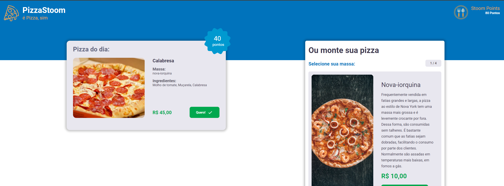

<h1 align=center>Pizza Stoom </h1>

##  📅 About

The application is about of the test for junior front-end developer from Stoom.




## 💻 How to execute the Project

### ✔ Pre requisite to Execute

```
	# Clone the project
	❯ git clone https://github.com/jandersonvb/pizza_stoom.git

	# Access folder
	❯ cd pizza_stoom

	# Install dependencies
	❯ npm install

	# Execute the aplication
	❯ npm run dev
```

## 💻 Technologies

- NextJs
- React
- SCSS
- React Icons
